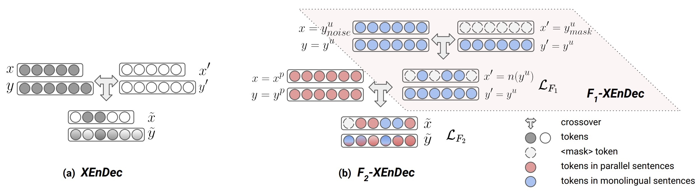

# Self-supervised and Supervised Joint Training for Resource-rich Machine Translation

This is the code for the paper:
[Self-supervised and Supervised Joint Training for Resource-rich Machine Translation](https://arxiv.org/abs/2106.04060). Presented at ICML 2021.


*Please note that this is not an officially supported Google product.*


If you find this code useful in your research then please cite:

@inproceedings{chengselfsup, \
  title={Self-supervised and Supervised Joint Training for Resource-rich Machine Translation}, \
  author={Yong, Cheng and Wei, Wang and Jiang, Lu and Wolfgang, Macherey}, \
  booktitle={ICML}, \
  year={2021}
}


## Introduction

This paper improves resource-rich neural machine translation by a new joint training paradigm, where NMT models are learned in a single stage using a self-supervised objective (on monolingual sentences) in addition to a supervised objective (on parallel sentences). The new method is called crossover encoder-decoder (XEnDec), inspired by the chromosomal crossovers in Biology, to exploit the complementary signals in self-supervised learning to facilitate supervised learning. The method achieves substantial improvements in two representative resource-rich translation tasks, WMT’14 English-German and WMT’14 English-French.


## Approach

Our method (XEnDec) is inspired by the chromosomal crossovers in Biology. For example, a hybrid that is the offspring of two parent animals defines the first filial generation (F1) or F2 generation in case that the process is repeated. The offspring shares similar features as its parent animals but may also have special properties that are different from either parent.

Likewise, our method XEnDec applies XEnDec to “deeply” fuse the monolingual (unlabeled) and parallel (labeled) sentences. It needs two sentences as inputs (parents), where two source sentences are shuffled and its corresponding target sentence (offspring) is generated by a mixture model (see the figure below). This process produces an F1 and F2 generation that exhibit
combinations of traits that differ from those found in their parents (the monolingual or the parallel sentence).

The final training objective is jointly optimized using two additional losses: a loss on the F1 generation and a loss on the F2 generation. Please find more details in the paper.




## Training with F2-XEnDec on WMT’14 English-German

Before training the model, you should at least specify all of the following parameters defined in WmtEnDeXEnDec in lingvo/tasks/mt/params/wmt14_en_de_xendec.py

* DATADIR: data directory
* DATATRAIN: training data
* DATADEV: development data
* DATATEST: test data
* VOCAB: vocabulary in the word piece model
* vocab_size: vocabulary size
* mask_word_id: id for \<mask\>
* pad_id: id for \<pad\>
* mask_words_ratio: the shuffle ratio p_{1}
* source_mask_ratio: a constant shuffle ratio. If it is zero, source_mask_ratio_beta will be used.
* source_mask_ratio_beta: the beta distribution for sampling the shuffle ratio p_{2}
* permutation_distance: permutations of source sentences
* use_prob_cl: whether to gradually use model predictions, described in computing h in section 3.2
* atten_drop: dropout ratio for the attention matrices, described in computing A in section 3.2
* use_atten_cl: whether to gradually sharp the attention distributions, described in computing A in section 3.2

You need to set DATADIR in wmt14_en_de_xendec.py as your file directory.

Here, we take an example of English->German translation to introduce how to train and evaluate the model on an 8-gpu machine.

```
python3 -m lingvo.trainer --run_locally=gpu --mode=sync --saver_max_to_keep=1000  --logdir=./train/log --job=controller,trainer_client  --model=mt.xendec.wmt14_de_en.WmtEnDeXEnDec --logtostderr --worker_gpus=8
```


### Evaluating dev and test sets on CPUs:

```
python3 -m lingvo.trainer --run_locally=cpu --mode=sync --saver_max_to_keep=1000  --logdir=./train/log --job=decoder_Dev  --model=mt.xendec.wmt14_de_en.WmtEnDeXEnDec --logtostderr

python3 -m lingvo.trainer --run_locally=cpu --mode=sync --saver_max_to_keep=1000  --logdir=./train/log --job=decoder_Test --model=mt.xendec.wmt14_de_en.WmtEnDeXEnDec --logtostderr
```

Please refer to [link](../../README.md) to check how to set up a cluster to exploit more GPUs.

## Results on WMT’14 English->German and German->English


|| English`->`German | German`->`English |
| ---------- | --------------------- | --------------------- |
| Transformer |        27.92           |               31.86          |
| F_2-XEnDec (Ours)  |        **30.07** |              **33.58**      |

*This table contains the reproduced results by running the vanilla training and our approach on cloud machines of 8 V100 GPUs with the Transformer base model as backbone model. The results are slightly lower than the number reported in our paper because experiments in our paper use a cluster of 128 GPUs with larger batch size and more training steps. *
